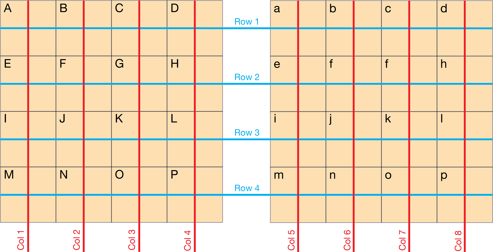
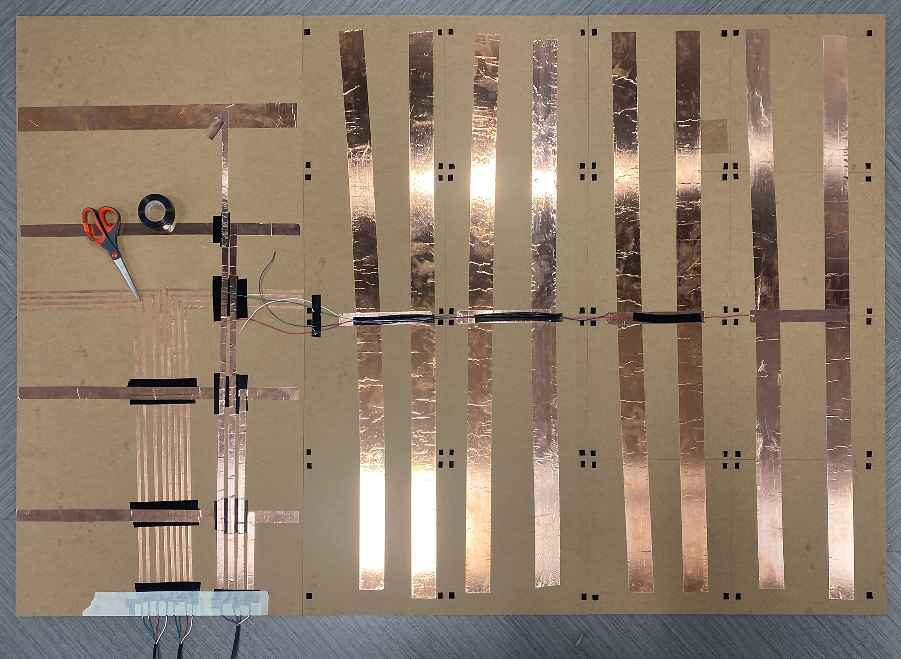

# Gotta Catch 'em All
## Disclaimer
***Disclaimer: The Pokémon name, trademark and franchise are all Copyright to Nintendo, Pokémon, Creatures Inc and Game Freak inc. This game is intended as a Fan Game and a course project, and claims no rights or association with aforementioned companies or their products.***

## Description
Gotta Catch 'em All is an interactive Pokémon-themed game inspired by foursquare and the Pokémon games. The game brings together the active aspects from the well-known playground game of foursquare and the familiarity of Pokémon to create a fun, interactive experience that brings back the child in all of us.

This project can be run just on the computer with a keyboard as input, but for the full emersive experience, the optional components are advised.

This project was done with Joy Brown and Shiwen Jiang for ID 3510: Interactive Products in Fall 2019 at the Georgia Institute of Technology. The original presentation for the project can be found [here](Presentation.pdf) and the video can be found [here](https://drive.google.com/open?id=1EMmAZx8vx8kNBeF9AtVb7qij_3s1D3JW).

## Requirements
### Devices
1. Computer (macOS or Windows)
2. (Optional) Arduino Uno
3. (Optional) Projector

### Installations
1. Install [Processing](https://processing.org/download/) and required packages.
   - Install [Minim](http://code.compartmental.net/tools/minim/) for sound.
2. (Optional) Install [Arduino IDE](https://www.arduino.cc/en/main/software) and required packages.
   - Install [Keypad Library for Arduino](https://playground.arduino.cc/Code/Keypad/).
   
## (Optional) Building the Contact Sensor Grid
### Materials
- 3x [4ft x 8ft White Tile Boards](https://www.homedepot.com/p/EUCATILE-32-sq-ft-96-in-x-48-in-Hardboard-Thrifty-White-Tile-Board-HDDPTW48/205995949)
- 3x [2 inch Copper Tape](https://www.amazon.com/gp/product/B07C6YLNYL/ref=ppx_yo_dt_b_asin_title_o09_s00?ie=UTF8&psc=1)
- 2x [Rubber Playground Balls](https://www.amazon.com/gp/product/B0000C8648/ref=ppx_yo_dt_b_asin_title_o00_s00?ie=UTF8&psc=1)
- 1x Black Paint
- 1x White Paint
- 2x Paintbrushes

### Tools
- Woodworking Tools
  - Bandsaw
  - Tablesaw
- Electronics Equipment
  - Soldering iron
  - Wiring kit (wires, wire strippers, electrical tape, solder, etc.)
- Basic Tools
  - Scissors
  - Glue gun

### How it works
#### Contact Sensor
The contact sensor has a simple mechanism that allows for detecting whether the sensor is pressed or not. The top panel is covered with copper tape connected to a pin on the arduino. The bottom panel is also covered with copper tape connected to another pin on the arduino. There is no connection by default because a small gap exists between the two panels created by thin spacers. When pressure is applied on the top panel, the top panel slightly flexes, causing the copper tapes on the two panels to touch, thus creating an electrical connection.

 

#### Sensor Grid
To detect which specific sensor is triggered from a matrix of sensors, the multiplexing mechanism commonly used in keypads is used. The mechanism allows to detect an `m x n` number of inputs from `m + n` number of pins on the Arduino.

The top panels of the contact sensors are connected to each other vertically to form 8 columns and the bottom panels are connected to each other horizontally to form 4 rows. When one contact sensor is activated, it can be identified by the row and column the connection occurs. Each combination of the rows and columns is assigned a character for the Arduino to output through the serial port.

 

### Construction Instructions
1. Cut the white tile boards into the following dimensions and quantities:
   - 11.5"x11.5" squares x32
   - 4'x4' squares x2
   - 2'x4' rectangles x2
2. Apply copper tape
   - Apply copper tape to the back side of the top panels.
   - Apply copper tape to the top side of the bottom panels, connecting them vertically to form a total of 8 columns.
3. Apply spacers
   - Apply 0.25"x0.25" size velcro pieces (hook side) in each corner of each top panel.
   - Apply 0.25"x0.25" size velcro pieces (loop side) in each spot corresponding to the hook side velcros.
4. Solder using wires
   - Solder to create 8 series of panels, each with 4 panels in series.
   - Solder 2 series of panels to each row.
   - Solder each row to wires for plugging into the Arduino.
   - Solder the columns from Step 2 to wires for plugging into the Arduino.
   - Hide all wiring in between the two 2'x4' white tile boards.
5. Test
   - Plug all wires into the Arduino.
   - Upload [InputPad.ino](PokemonGame/InputPad/InputPad.ino) to the Arduino.
   - Open the serial montor to check for the pads are functioning.
6. (Optional) Painting the playground balls
   - Paint the red playground balls with the black and white paint to look like pokéballs.

## Running the Game
1. (Optional) Connect and set up the contact sensor grid.
   - Open [PokemonGame.pde](PokemonGame/PokemonGame.pde) using Processing.
     - On line 21, modify the variable from `usePort = false` to `usePort = true`
   - Connect Contact Sensor Grid to Arduino
   - Upload code and connect to Arduino
     - Upload [InputPad.ino](PokemonGame/InputPad/InputPad.ino) to the Arduino.
     - Keep the Arduino connected to the computer
   - Set up projector
     - Connect the computer to the projector
     - Orient and change the settings on the projector to display onto the contact sensor grid.
     
2. Run the game through Processing
   - Open [PokemonGame.pde](PokemonGame/PokemonGame.pde) using Processing.
   - Run by pressing Sketch > Present or by pressing the shortcut `Shift + Command + R`

## Playing the Game
### Rules:
- The game is played by 2 players (or 2 teams).
- Each players starts with 1 playground ball.
- Each player must throw a ball from behind their side of the playing field to catch pokémon on the other side by hitting the square the pokémon is in with the ball.
- Each player must throw a ball from behind their side of the playing field to catch pokémon on the other side.
- First player to catch all four pokémon (Bulbasaur, Charmander, Squirtle, and Pikachu) first wins the game.
- Each pokémon has a unique move
  - Bulbasaur moves randomly to adjacent squares.
  - Charmander uses dig to disappear and appear in a random square.
  - Squirtle uses protect to cast a shield that blocks a single pokéball.
  - Pikachu uses double team to create 4 illusions randomly spread out on the squares that disappear once hit.
